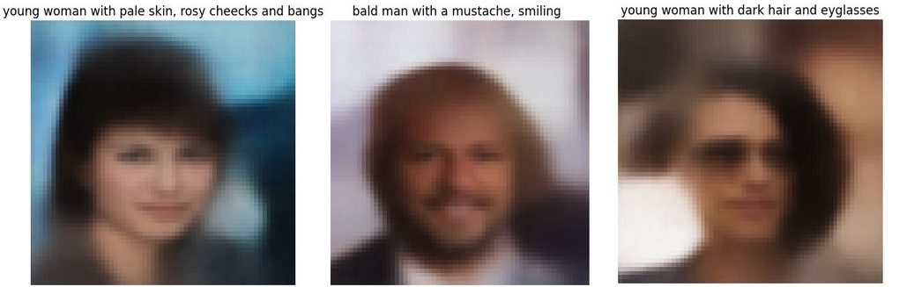

# Text to image generation with CLIP

This project aims to implement a text to image generation model using CLIP 
and a couple of image generation models. Our goal is to compare how different models
perform in this task.

# Architecture

## CLIP

A multimodal model developed by OpenAI, learns to understand images and text together​

It learns to give similar embeddings to matching image-text pairs​

We can use that to condition models during training

## Variational Auto-Encoder (VAE)

A VAE learns a latent distribution of training data. The Encoder learns to
encode an input image to a latent distribution.

Then the decoder tries to reconstruct that image by sampling random vector from the latent space.

## Conditional VAE (CVAE)

With VAE we can't control what image we get when we sample random vector. 
That's why we used Conditional VAE (CVAE)

In CVAE we add some label to the input image before we pass it into the encoder and to a sampled vector before we pass it into the decoder. Because of this the model learns to correspond that label with some type of images.

In this case we condition models on attribute vectors and CLIP embeddings of text prompts.

## Generative Adversarial Network

# Data

## Dataset

We used CelebA dataset. It contains over 200000 portraits of celebrities, 
each with 40 binary attributes (male, wavy hair, smiling, wearing 
eyeglasses).

## Data preprocessing

To speed up training we resized images to 64x64 and normalized them. 

Since each image has a one-hot encoded attribute vector and we want a text
description of the image, we give each image a description made up from
those attributes. This is done by turning each attribute into a part of a 
sentence ("Eyeglasses" -> "wearing eyeglasses", "High_cheeckbones" -> "with high cheeckbones"). 
This was a straight forward method but it seemed enough for this usecase.

Also to save time during training all CLIP embeddings of those prompts were precomputed.

# Results

Images generated with CVAE:

